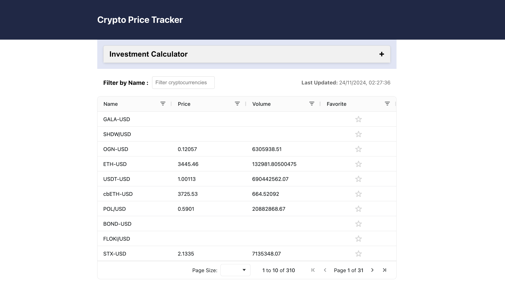
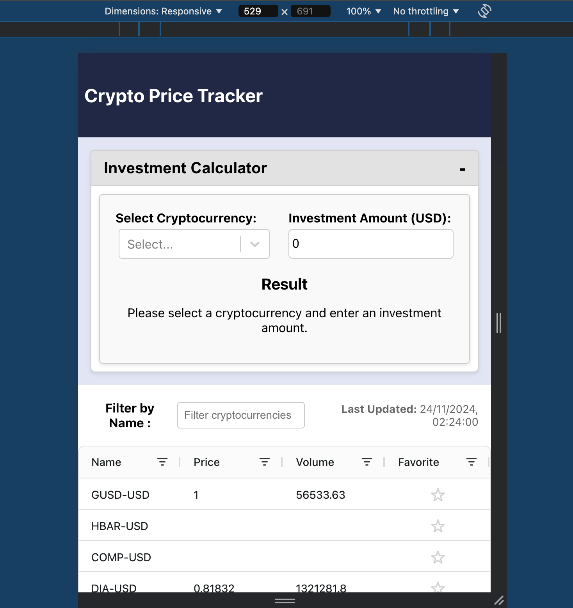
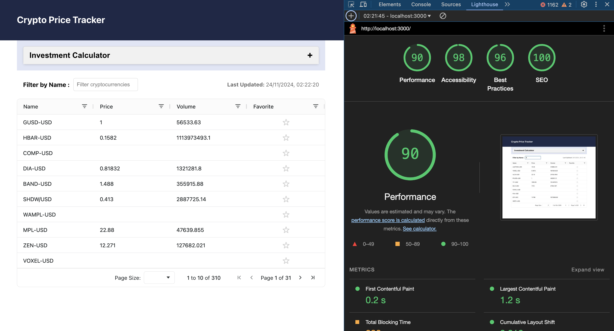

# Crypto Price Tracker

Cryptocurrency price tracker with real-time updates. This is a responsive React application using TypeScript that connects to REST APIs and displays real-time cryptocurrency prices. It allows users to filter and simulate investments.

## Prerequisites

- npm 9.\*
- Node.js 18.\*

## Application Features

- **Investment Calculator**: Includes an accordion to open and close the form.
  - Search and select options for cryptocurrencies to enhance user experience.
- **Search Filter**: Filter cryptocurrencies by name in the grid.
- **Real-time Updates**: Displays real-time cryptocurrency prices.
- **Favorite Crypto**: Added favorite column to set the favorite crypto for quick filter by set of group
- **Responsive Design**: Design to view across different device

## Trade-offs

- Reduced the ticker call on load with initial 20 to reduce the first byte time
- Added debounce feature for search filter to avoid data problem in grid
- Used react-ag-grid with rich functionality such as sorting and searching inside the grid with better performance

## Suggestions

- Implement lazy loading for API calls, as not all 200 or 300 crypto information is required on page load
- Batching or rate limit for ticker to reduce the network call
- Instead of rest API we should think about WebSocket as well for data streaming
- Would add TSLint/ESLint configuration
- Add more test at low level and boundary conditions

## The application consists of one page with three sections.

- Header
- Investment Calculator

  - The form consists of two inputs: one for searching and selecting the crypto, and another for providing the number of units to see the value.
  - Once input details provided at the bottom of the form you can see the result

- Grid for the Crypto data and filter option
  - Filter option on each columns
  - Sorting on each column
  - Added a favorite column to set favorite crypto and sort it as well
  - Pagination at the bottom of the grid with an initial page size set to 10 by default, which can be increased to 20, 50, or 100
  - Option to move through different pages

### Technical implementation

The application has a good mix of React features with TypeScript across all components. Some highlights include:

- React Context to store the data and pass through components
- React useCallback, useMemo, useEffect, useState
- Component modularization to have better readability, scalability, maintainability and testability

### Folder Structure

- Store
  - Context.tsx serves the business logic for fetching data and passing it to components
- The Components folder includes all the components
  - Accordion
  - Crypto Grid
  - Crypto View
  - Error Message
  - Header
  - Investment Calculator

### Available Scripts

To install the dependency required for the application (from the project directory):

#### `npm install`

In the project directory, you can run to start the application:

#### `npm start`

Open [http://localhost:3000](http://localhost:3000) to view it in the browser. The page will reload if you make edits.

Launches the test runner in the interactive watch mode.

#### `npm run test`

To view the test coverage run

#### `npm run test:coverage`

Builds the app for production to the `build` folder.
It correctly bundles React in production mode and optimizes the build for the best performance.

#### `npm run build`

## Desktop View screen

## Responsive Screen for mobile screen

## Non-functional Matrix of application (Performance, Accessibility, Best Practice, SEO)

## Functional view of application

[Functional Screen View](public/Recording.mov)
